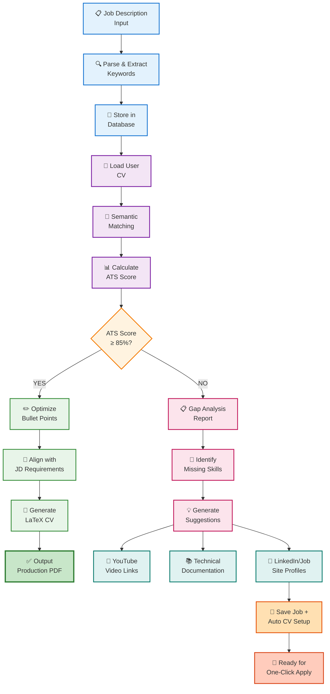

# AI RESUME BUILDER: RAG driven career evolution
- An automated RAG based pipeline that evolves your career "Skeleton" into a polished LaTex "Skin".

## Introduction:-
- Building a resume shouldnt be a repetitive manual task or process. AI-Resume Builder is a production ready tool designed to solve the "RELEVANCE GAP" in job applications. Using Langgraph for state management and ChromaDB for semantic retrieval (RAG), this tool intelligently selects the most impactful experirence from your history and tailors them to fit specific JD and user needs. 

- By focusing on ATS and LaTex percision, this ensures your proffesional identity is always presented at its biological test.


## System Anatomy:(Architechtural diagram)
- Here the system is built as a Directed Acyclic Graph(DAG). As workflow is more essential for understanding how the "Nerves" interact with "Memory":

```mermaid

    | Graph                                  |  TD                                    |
    |----------------------------------------|----------------------------------------|
    | A[main.py: Input JD]                   | B[graph.py: Workflow Logic]            |
    | B[graph.py: Workflow Logic]            | C[nodes.py: RAG Retrieval & Tailoring] |
    | C[nodes.py: RAG Retrieval & Tailoring] | D[state.py: Memory Persistence]        |
    | E[edges.py: Conditional Routing]       | F[main.py: Final LaTeX Output]         |
```    


## Setup & Installation
- For end users(Quick Start)
- If you just want to generate a resume, follow these steps:
1) Clone : git clone https://github.com/yourusername/Resume-Builder.git
2) Environment: Create a .env file and add your OPEN_API_KEY
3) Execute: 
   * Windows: python main.py
   * Linux/Mac: python3 main.py


# Guide to 'OPERATE THE ORGANISM'
- Follow the instruction to actually use the tool once its installed.

1) Prepare the Skeleton: Open master_resume.txt and paste your professional history.
2) Run the application: python main.py 
3) Feed the JD: When prompted , make sure you paste the Job Description you are targeting.
4) Retrieve teh skin: Once the process completes, find your tailored Final_resume.tex in the root folder and upload this to 'OVERLEAF' or your local LaTex compiler.


# Research DNA: Credits
- To give credit to the vedios and documents that helped me build each functions are as follows:
  * Vector Search : Inspired by https://docs.trychroma.com/docs/overview/getting-started. Used for high precision expereince retrieval | https://docs.trychroma.com/guides/deploy/gcp.
  * Workflow orchestration: Built using patterns from https://docs.langchain.com/oss/python/langgraph/overview.
  * Documentation: Structured based on https://www.youtube.com/watch?v=E6NO0rgFub4 | https://www.youtube.com/watch?v=T-D1OfcDW1M
  * Errors handling: https://stackoverflow.com/questions/2541616/how-to-escape-strip-special-characters-in-the-latex-document,


## Future Enhancement


## For contributors:(Developer setup)
- If you want to help evolve the organism:
1) Virtual Environment: python -m venv env
2) Activate:
   * Windows: .\env\Scripts\activate
   * Linux/Mac: source env/bin/activate
3) Dependencies: pip install -r requirements.txt
4) Docs: Refer to https://docs.langchain.com/oss/python/langgraph/install | https://docs.trychroma.com/docs/overview/getting-started


## The Biological Components:
- Ecosystem of my project are follows:-
 
|File                 |      Role           |           Description                                               |
|---------------------|---------------------|---------------------------------------------------------------------|
|master_resume.txt    |      Skeleton       |           Private. Your full, raw career DNA.                       |
|brain.py             |      Memory         |           The llm logic that adapts the content to the environment. |
|skeleton.py          |      Joints         |           Vector storage handling semantic search.                  |
|workflow.py          |      Blood          |           Circulates state through the nodes                        |
|main.py              |      Skin           |           The healing logic that cleans LaTex syntax.               |


## Contributors Expectations:~
- I welcome contributors! To keep the organism healthy
1) Issues first: Please open an issue before submitting a pull request.
2) Pull requests: Ensure your PR includes updated documentations if you modify the state.py or nodes.py
3) Code style: Maintain the "Human Body" naming convention where applicable.
